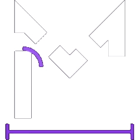

<!-- Modified for Manor: project presentation, setup guidance, and community links. -->
<p align="center">
  
</p>

<h1 align="center">Manor</h1>

<p align="center"><em>A home for your service business, with a team of AI agents.</em></p>

<p align="center">by <a href="https://pentridgemedia.com">Pentridge</a></p>

---

## The problem with running a service business

Leads, customer records, invoices, and recurring tasks often live in separate tools.
AI adds more options, but connecting them to everyday business operations still
takes work. Manor gives service businesses a shared place to organize that work
and build a team of agents around it.

## What Manor is

Manor is an AI agent platform for service businesses. It brings a team of agents,
a built-in CRM, business data, and recurring work into one place: a home for your
business that connects with the tools and AI platforms you already use.

The product centers on three areas:

- **Agent workspace:** bring relevant operational data together so agents and people
  can work from shared context. A property management business might organize leases,
  utility workflows, and campaign results here.
- **CRM:** keep contacts and deals in a system of record alongside the agents that
  work with them. The direction is to connect website and form intake to follow-up
  workflows and track how leads become customers.
- **Business agents:** give each agent a role, responsibilities, and boundaries.
  Intake, content, and payments are examples of roles you can build toward, with
  routines and webhook triggers connecting them to business processes.

See the [product priorities](./WISHLIST.md) for the intended direction and the
[documentation index](./docs/README.md) for implementation details. The workspace
currently has specific operational sections; a freely configurable canvas is a
product priority, not a finished setup experience.

## Make it your own

Use Manor as a template for your own service business. Fork or clone it, run your
own instance, and adapt the agents, workflows, workspace, and branding to fit your
operations. You can keep the current logo and sprites or use your own branding;
see the [asset guide](./public/README.md).

Start with one agent and one recurring source of friction. Give it a clear role,
connect the tools it needs, and verify a small task before adding routines or more
agents. The first useful result matters more than configuring an entire team.

This repository follows the maintainer's product direction. Suggestions and bug
reports are welcome; contributing changes back is optional. Business-specific
customizations can live in your own fork.

## Agent computers

Each agent in Manor is hired like an employee, not prompted like a chatbot. You give it a name, a role, and a charter — what it owns, what good work looks like, and where it must stop and ask you. Then it gets the thing no chatbot has ever had:

**Its own computer.**

A real one, in the cloud — with a browser, a terminal, files, and a desktop. Your agents sign into the same tools you use — email, calendars, CRMs, spreadsheets, the web — and use them the way a person does: clicking, typing, navigating, filing. When a login wall appears, the agent hands you the screen; you sign in once, and your whole staff is signed in.

And because the computers live in the cloud, **your agents keep working after you close your laptop.** Routines fire at 7am whether you're awake or not. The Friday close happens on Friday. Work stops waiting for you.

## How you build your staff

**Hire by writing a charter.** A role, its responsibilities, its boundaries — the same brief you'd give a new hire on day one. Agents that must ask about everything are useless; agents that never ask are dangerous. The charter is where you draw that line once, instead of worrying about it every day.

**Show it the work — once.** Open an agent's computer, hit *Teach a task*, and walk through the workflow while it watches. It saves what you did as a named skill. Attach a schedule, and something you used to grind through every week now happens every night without you.

**Let them build the team.** Agents can hire other agents. A coordinator can spin up a specialist for a lane of work, hand it a charter, and manage it — which is the moment one assistant quietly becomes a company.

**Bring the model you already pay for.** Manor doesn't sell you tokens. Connect the AI subscription you already have — ChatGPT Plus/Pro, Claude Pro/Max, GitHub Copilot, SuperGrok — or paste any API key. Your models, your spend, your data.

## Under the hood

TypeScript end to end — React 19 + Vite on the web, Electron on desktop, Expo on mobile. Hono + oRPC APIs, PostgreSQL + Prisma, Graphile Worker for the always-on machinery, sandboxed agent computers on Docker (with E2B and Daytona as managed options), model access through Pi, and hundreds of app integrations through Composio.

## Run it yourself

For a source checkout, use Node.js 22.22.2 or a version supported by
[`package.json`](./package.json), pnpm 9.15.0, and Docker with the Compose plugin.

```bash
git clone https://github.com/sirakinb/manor.git
cd manor
cp .env.example .env
```

Set `BETTER_AUTH_SECRET`, `ENCRYPTION_KEY`, and `SCREEN_PROXY_SECRET` in `.env` to independent
long random values. Docker sandboxes also need a dedicated `SANDBOX_SUPERVISOR_TOKEN`. You can
also set `OPENROUTER_API_KEY`, or connect a supported model provider during onboarding.

Managed app catalogs are optional. Set `COMPOSIO_API_KEY` for Composio, or the
`PIPEDREAM_CLIENT_ID`, `PIPEDREAM_CLIENT_SECRET`, and `PIPEDREAM_PROJECT_ID` trio for Pipedream
Connect. Users can add an HTTPS MCP server, Treg endpoint, or OpenAPI JSON document from
**Integrations** without enabling either managed catalog. Connector credentials are encrypted on the
server and are never returned by the API.

Native Google Forms access is also optional. Enable the Google Forms API and Google Drive API in a
Google Cloud project, create an OAuth Web client, and authorize
`<WEB_ORIGIN>/api/auth/callback/google` as its redirect URI. Set `GOOGLE_CLIENT_ID` and
`GOOGLE_CLIENT_SECRET` on the API server. Manor requests only form editing, response reading, and
app-file Drive access; provider tokens are encrypted at rest.

Treg is usage-metered. Self-hosters supply their own Treg token; operators embedding Treg in a
hosted product should review [Treg's integration terms](https://treg.to/integrate.md), which require
a written agreement for hosted resale.

```bash
docker compose --env-file .env -f infra/compose/docker-compose.yml up postgres -d
pnpm install
pnpm db:generate
pnpm db:migrate
pnpm sandbox:build
pnpm dev
```

Open [http://127.0.0.1:5173](http://127.0.0.1:5173), create an account, connect a model, and create
your first bot.

That runs Manor locally. To deploy a source checkout on a VPS, follow the
[deployment guide](./docs/DEPLOY.md). It covers server preparation, configuration,
and the Compose launch command. A guided command that takes a fresh clone through
VPS setup and first-agent verification is planned; it is not available yet.

### Self-host from published images

To install without a source checkout or Node.js, follow the
[published-image setup](./docs/self-host.md#published-images-no-checkout). It uses Manor's image
namespace and explains how to select compatible tags. You need Docker Engine, the Compose plugin,
curl, and OpenSSL.

## Desktop and mobile

The Electron and Expo apps are clients of the same Manor API used by the web app.

With the development stack running, launch Electron with:

```bash
pnpm --filter @rakazo/desktop dev
```

On first run the desktop app asks whether to use the stack on this computer
(`http://127.0.0.1:5173`) or connect to an existing server. Public servers must use HTTPS; HTTP is
accepted only for loopback and private LAN addresses (not link-local). The app verifies the
server's health endpoint before saving, and later launches go straight to that instance.

Use **Change Server…** in the application menu to reconnect. Closing that window without
saving returns to the previous instance. For development automation, set `RAKAZO_WEB_URL` to point
the shell somewhere else without changing the saved instance, or `RAKAZO_FORCE_SETUP=1` to run
setup again.

## Web UI language

The web (and Electron-hosted) UI supports English, Deutsch, 한국어, Türkçe, हिन्दी,
Português (Brasil), and 简体中文. Change it under **Settings → Language**. The marketing
homepage (`apps/www`) is available in en/de/ko via footer language links (`/`, `/de/`,
`/ko/`); other marketing pages stay English.

## Contributing and support

See [CONTRIBUTING.md](./CONTRIBUTING.md) for development and pull-request guidance.
Use [Manor issues](https://github.com/sirakinb/manor/issues/new/choose) for bugs and self-hosting help.
Report vulnerabilities privately using [SECURITY.md](./SECURITY.md).

## License and acknowledgments

Apache 2.0 — see [LICENSE](./LICENSE).

Manor is built on [Rakazo](https://github.com/elie222/rakazo) and includes modifications for Manor.
See [NOTICE](./NOTICE) for attribution and [THIRD_PARTY_NOTICES.md](./THIRD_PARTY_NOTICES.md)
for separately licensed bundled material.
