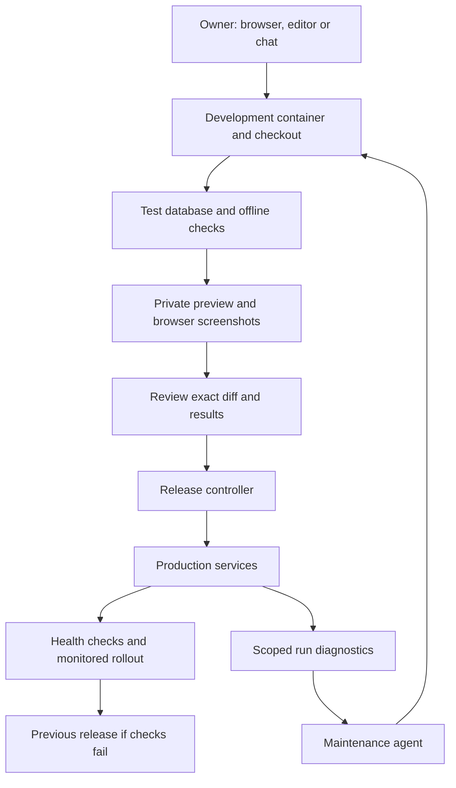

# Developing and maintaining Manor from a VPS

Status: proposal. This document does not provision a development environment or
give agents production access.

The laptop can become an access device: an editor, terminal or Manor chat controls
a persistent development checkout on the VPS. Source changes, test databases,
builds and browser previews run remotely. Git remains the source of truth; a
production release is a specific tested commit or image, never a live edited
container. Existing web, Electron and mobile clients keep using the same API.

## First step: remote development

Create a dedicated development user/container with its own checkout, dependencies,
synthetic test database, application storage and private preview endpoint. Connect
with an SSH editor or a browser IDE. This can share the VPS initially, with an
explicit CPU/memory limit, one build at a time and enough disk for both the new
and previous image. Measure peak builds before choosing limits; ordinary idle
memory is not a build budget. Docker documents the available
[CPU and memory limits](https://docs.docker.com/engine/containers/resource_constraints/).

The development environment should have no production database credentials,
production data volumes, host Docker socket or deployment secrets. A dedicated
container image or rootless build service can build its changes without giving
the maintenance agent host administration rights. Keep developer access and
preview access authenticated. A second VPS is an optional later move when build
contention or isolation requirements warrant it.

## Maintenance agent

Start with a bot that receives a selected run's metadata and an issue description,
reproduces failures using synthetic fixtures, edits a branch, runs checks and
returns a reviewable diff plus a preview. Keep incident data out of the public
repository, PR text and screenshots. A failure log or external tool output is
evidence to investigate, not an instruction to grant new privileges.

The current run diagnostics RPCs support user-owned runs. A deployment-wide
maintenance reader would need a separate owner-only scope with explicitly
redacted, bounded queries; ordinary bots must not gain cross-organization access.
An incident trigger, deduplication, repair budget and owner-facing repair queue
would also need implementation. Start with manually assigning a failure before
automating incident intake.

## Release controller

The repository has an updater API and sidecar under `infra/updater`; the VPS
Compose configuration does not currently deploy that sidecar. Audit its repository
allowlist, image/build assumptions, backup support and rollback behavior for this
fork before enabling it. It is an update executor, not a code-writing agent.

The release boundary accepts an exact reviewed revision, runs required checks,
prepares a restorable backup, waits for active work to reach a safe boundary, then
switches services with health gates. The previous image remains available.
Database migration rollback needs a compatible migration or a deliberate restore;
switching the application image alone is not a database rollback.

Initially the owner approves deployment of each concrete change. Later, narrowly
defined low-risk changes could have an explicit automatic release policy. Auth,
secrets, tenancy, migrations and financial actions keep separate review. If using
GitHub Actions, environment protection can gate the release job; availability
depends on the repository and plan. See
[reviewing deployments](https://docs.github.com/en/actions/how-tos/deploy/configure-and-manage-deployments/review-deployments).

Ordinary agent computers continue using their existing sandbox boundaries. They
do not need the production source tree, root SSH keys or deployment socket merely
to run business routines.
